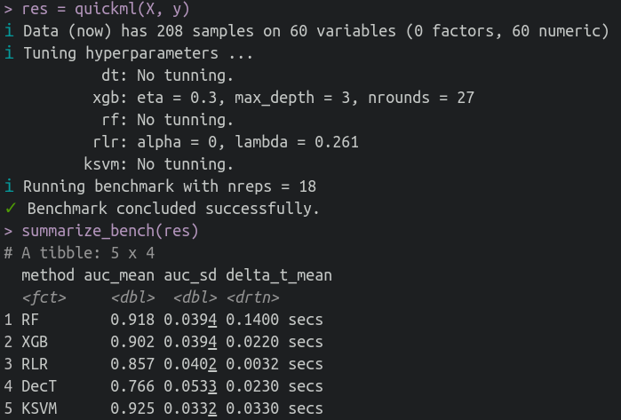
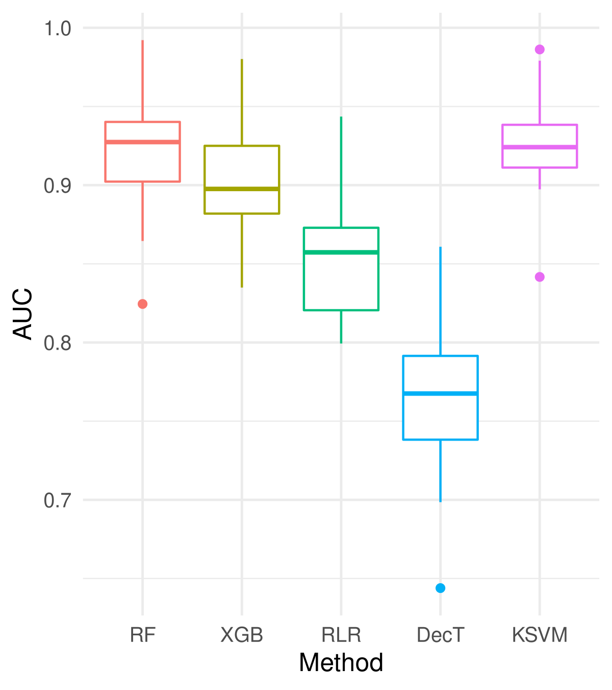

<!-- README.md is generated from README.Rmd. Please edit that file -->

# quickml

<!-- badges: start -->
<!-- badges: end -->

**quickml** is an R package that aims to provide a full ML pipeline to
rapidly benchmark a binary classification problem by running some of the
most common algorithms on it. Ideally, once fully functional, it should
handle any *raw* dataset, automatically cleaning it up, recoding
factors, filtering problematic features, imputing missing values, doing
some basic hyperparameter tuning, etc. By comparing the performance of multiple methods on the same task,
it will give you an idea of the limits of performance achievable on the
given dataset. In other words, it tells you how hard of a classification
task it is.

Some of the pre-test steps are:

-   Converting character features to factors (i.e., categorical
    variables).
-   Removing highly diverse factors (e.g., phone numbers or IDs).
-   TODO: Removing almost constant factors
-   Coding factors into dummy variables.
-   TODO: Imputing on train/test.
-   Hyperparameter tuning for some of the algorithms.

Currently the following algorithms are used for the benchmark:

-   **Random Forest (RF)**: No tuning.
-   **Gradient Boosted Trees (XGB)**: XGBoost implementation. Basic tuning (number of rounds by early stopping on validation AUC, max_depth, eta).
-   **Regularized Logistic Regression (RLR)**: L2-regularized. `glmnet` implementation.
    <!--- with alpha parameter decided between 0 or 1 (L2 vs. L1regularization, respectively) during hyperparameter tuning.--->
    Regularization parameter lambda is tuned.
-   **Decision Tree (DecT)**: A single decision tree. No tuning.
-   **Kernel SVM (KSVM)**: SVM with the Gaussian (a.k.a Radial Basis) kernel. No tuning.

## Installation

quickml is under development. You can install the latest version in R by running the follwoing command:

``` r
devtools::install_github("aaamini/quickml")
```

## Example

This is a basic example which shows you how to run it on the Sonar data from the `mlbench` library:

``` r
library(quickml)
library(mlbench)

## basic example code
data("Sonar")
data = Sonar
y = data$Class
X = subset(data, select=-Class)
res = quickml(X, y)
summarize_bench(res)
plot_bench(res, save = TRUE, type = "png")
```

It produces the following output:



and the following plot:




